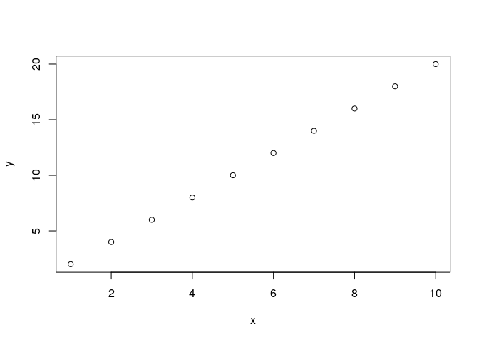

Writing functions in R
======================

Functions are a way to package up bits of code to make them easy to reuse. Base R includes numerous built-in functions and there are thousands more R functions in packages available on CRAN and elsewhere.

Here is an example of one of the built-in R functions, `sum()`:

``` r
x <- c(1,2,3,4,5) # Create an array of numbers to sum
sum_x <- sum(x) # Sum the numbers contained in 'x', and save the result as a new variable 'sum_x'
```

You can also write your own functions, called "user-defined functions".

Functions in a package are the same thing as functions you define yourself, they're just stored in a different way.

You can see the code underlying a function by typing its name (without brackets) in the console and hitting "enter".

Why use functions?
------------------

### Abstraction

One of the benefits of functions is they abstract away the details of *how* the code works. To use a function, all you need to understand is *what* the function is designed to do.

When you're writing your own function, you'll obviously need to understand how it works when you're writing it, but you won't need to think about it everytime you use it. This is particularly useful for things you might want to do more than once.

### Code maintenance

If you write functions instead of writing variants of the same code over and over, generally your code will be much more succinct. This makes it a lot easier to QA, as each function only needs QAing once; and a lot easier to modify, as you only need to change your code in one place. It means you're less likely to make mistakes, and if you do you only need to correct the code once.

### Code legibility

You can use functions to make your code more succinct and better structured - done well, this can make your code a lot easier to understand for someone unfamiliar with it, or even yourself in a week's time or a few months down the line.

In short, using functions can make your code easier to read, easier to write, easier to QA and easier to modify. So really the question is why would you not use functions!

How to write a function
-----------------------

The syntax for creating a function is:

``` r
function_name <- function(arg1, arg2){
        # function body, e.g. 
        print(paste(arg1, arg2))
}
```

We're using the function `function()` to create a function (sorry, couldn't resist!) and assign it to the name `function_name`.

A function is made up of three components:

1.  Its *arguments* (in this example, `arg1` and `arg2`)
2.  The function *body* (everything between the curly brackets)
3.  And the function *environment* (we're going to ignore this for now)

*Arguments* are variables used inside the function body which we can set each time we call the function. The function *body* is where we put the code.

### Examples of functions

#### Example 1

Here's an example of a very basic user-defined function, that adds two to a numerical variable:

``` r
add_two <- function(x){ # On this line we've named our function 'add_two', and have included 'x' as an input variable (a function argument)
  
  # This function takes the argument 'x', and adds 2 to it
  result <- x + 2
  return(result) # The output of the function
  
}
```

Let's try using the function "add\_two":

``` r
add_two(3) # Calling the function by itself prints the result to the console
```

    ## [1] 5

``` r
result <- add_two(3) # Alternatively the result can be saved as a new variable
```

The return statement is not always necessary, as R will automatically return the variable on the last line of the function body. So this version of the function above would also work:

``` r
add_two <- function(x){
  
  result <- x + 2
  
}

result <- add_two(3)
```

#### Example 2

Functions can accept as many arguments as you like, but can only output one object (if it is necessary to output more than one object, then the desired outputs can be combined together into a list, and the list can be returned).

``` r
sum_squares <- function(x, y){
  
  result <- x^2 + y^2
  return(result)
  
}

z <- sum_squares(3, 5)
```

Arguments can be specified by position or name. In the above example, the function accepts arguments called `x` and `y`, with the order specified as `x` then `y` in the function definition. Therefore when `sum_squares(3,5)` is called, the arguments are interpreted as `x=3` and `y=5`. Alternatively, if we called `sum_squares(5,3)` then the arguments would be interpreted as `x=5` and `y=3`.

For more complicated functions with lots of arguments, specifying the arguments by position becomes more error-prone. Therefore it is often desirable to specify the arguments by name, then the order of the arguments doesn't matter:

``` r
sum_squares(x=3, y=5)
```

    ## [1] 34

``` r
sum_squares(y=5, x=3)
```

    ## [1] 34

#### Example 3

Functions can return different outputs depending on some condition, using the `return()` command:

``` r
mod_x <- function(x){
  
  if(x < 0){
    return(-x)
  }
  else{
    return(x)
  }
  
}

x <- -5
mod_x(x)
```

    ## [1] 5

As soon as a `return()` statement is encountered in a function, the function finishes and returns the variable in the `return()` statement. In the above example, `return()` is used twice as there is a condition with two possibilities. Either the input argument `x` is less than zero, in which case the function ends with the `return(-x)` statement, otherwise if `x` is not less than zero then the function continues to the `return(x)` statement.

#### Example 4

Depending on the purpose of the function, it doesn't need to return an output at all:

``` r
odd_or_even <- function(x){
  
  if((x %% 2) == 0){
    print("The number is even.")
  }
  else if((x %% 2) == 1) {
    print("The number is odd.")
  }

}

odd_or_even(x=4)
```

    ## [1] "The number is even."

#### Example 5

Sometimes it can be useful to include helpful error messages in functions, by anticipating the sorts of variables that could input. What happens if you try to use a non-integer or a string as an argument in the above example? Try the running the function with the following arguments:

    odd_or_even(x=1.5)
    odd_or_even(x="a")
    odd_or_even(x=c(1,2,3))

Here is an adapted version of the function, with some more informative error messages built in using the `stop()` function:

``` r
odd_or_even <- function(x){
  
  if (length(x) > 1){
    stop("The argument is not a single number.")
  }
  else if (!is.numeric(x)){
    stop("The argument is not a number.")
  }
  else if((x %% 2) == 0){
    print("The number is even.")
  }
  else if((x %% 2) == 1) {
    print("The number is odd.")
  }
  else{
    stop("The number is not an integer.")
  }

}
```

Now try passing some incompatible arguments to the function:

    odd_or_even(x=1.5)
    odd_or_even(x="a")
    odd_or_even(x=c(1,2,3))

#### Example 6

Here's an example of how to include optional arguments:

``` r
add_a_number <- function(x, y=NULL){ # y is the optional input, with a default value of NULL
  
  if(!is.null(y)){
    return(x + y)
  }
  else{
    return(x)
  }
  
}

add_a_number(x=6)
```

    ## [1] 6

``` r
add_a_number(x=6, y=7)
```

    ## [1] 13

#### Example 7

Any value can be used as a default value for an optional argument. For example, we can generalise the sum\_squares function above by allowing it to sum together two numbers raised to any power, but have a default power of 2:

``` r
sum_powers <- function(x, y, z=2){
  
  result <- x^z + y^z
  return(result)
  
}

sum_powers(x=3, y=5)
```

    ## [1] 34

``` r
sum_powers(x=3, y=5, z=3)
```

    ## [1] 152

#### Example 8

Sometimes being able to pass an arbitrary number of arguments can be useful, especially when another function is called within a wrapper function. This requires the ellipsis construct `...`, which is designed to pass a variable number of arguments to a function. Here's an example:

``` r
plot_x_and_y <- function(x, y, ...){
  
  plot(x, y, ...)
  
}

x <- 1:10
y <- (1:10) * 2
```

The function can be called with only the required arguments:

``` r
plot_x_and_y(x, y)
```



Or the function can be called with any optional arguments accepted by the plot function:

``` r
plot_x_and_y(x, y, col='red', type='l')
```


#### Example 9

Here's a less trivial example - this function takes a vector of strings as the argument, ensures all letters in the string array are lower-case, and makes use of "regular expressions" or "regex" to find and replace all spaces and punctuation marks with an underscore:

``` r
generalise_names <- function(names){
  
  library(stringr)
  
  names <- tolower(names) # Converts any uppercase letters to lowercase
  names <- stringr::str_trim(names) # Trim any blank spaces at the start or end of each string
  names <- stringr::str_replace_all(names, " ", "_") # Replaces spaces with an underscore
  names <- stringr::str_replace_all(names, "[^A-Za-z0-9]", "_") # Replaces anything that isn't a letter or number with an underscore
  names <- stringr::str_replace_all(names, "([_])\\1+", "\\1") # Replaces repeated underscores with a single underscore
  names <- stringr::str_replace_all(names, "^\\_+|\\_+$", "") # Removes any underscores at the beginning or end of the string
  
  return(names)
}

names <- c("Option 1", "   Option (1)", "Option: 1", "option 1", "OPTION - 1")

generalise_names(names)
```

    ## [1] "option_1" "option_1" "option_1" "option_1" "option_1"

When to write a function
------------------------

### When you've copied and pasted three times

There is a principal in software engineering called Don't Repeat Yourself (DRY) - which basically states that you should avoid duplication wherever possible. A good rule of thumb is whenever you find you've copied and pasted the same code three times, it's time to consider replacing that code with a function.

### To structure your code

You may also sometimes want to write a function for code you're only planning to use once as a way of structuring your code and "hiding" some of it to make your main script easier to read.

### A word of warning

The R ecosystem is full of high quality packages designed to solve all kinds of problems - it's generally best to make sure that a function doesn't already exist before writing your own. (This is really just an extension of the DRY principal).

How to organise your code
-------------------------

Whenever you're working on something it's generally best to create a new R project and version control your code using on GitHub. There's guidance on how to do this in the Analytical Platform guidance.

It's also best to keep your functions separate to the rest of your code to make them easier to find. There are a couple of ways to do this:

### Storing your functions in your project

The easiest way to store your functions is just to create a folder in your project called "functions" and saving your functions there.

You could either put each function in its own R script with the same name, or you could group related functions into clearly named scripts.

Then just use `source("my_functions_script.R")` (with `"my_functions_script.R"` replaced with the name of your script) to run the code and make your functions available to you in the current session. As with loading libraries, it's best to do this at the top of your script.

Here's an example of calling a script that contains a new function, called `pick_a_colour`:

``` r
source("functions.R")
```

Now the function is ready to use:

``` r
# Create a list of colours to provide to the function
colours <- c("Red", "Blue", "Green", "Magenta", "Cyan", "Yellow", "Purple", "Pink")

pick_a_colour(colours)
```

    ## [1] "Green"

### Writing packages

An alternative is to make your own package to store your functions which you can then use like any other R package. There are a few advantages to this:

-   It means you (and others) can access your functions from different projects
-   There are certain requirements for making R packages which enforce good practice, such as documentation

This comes at the cost of slightly higher overheads.

A few examples of packages written by people in MoJ are:

-   [s3tools](https://github.com/moj-analytical-services/s3tools)
-   [asdrap](https://github.com/moj-analytical-services/asdrap)

To find out more about writing packages, check out the further reading below. We're also hoping to do a Coffee and Coding session on it in future so watch this space (or let us know if you'd be interested in volunteering)!

Further reading
---------------

### On functions

-   [DataCamp writing functions in R course](https://www.datacamp.com/courses/writing-functions-in-r)
-   [Functions chapter](https://adv-r.hadley.nz/functions.html) of Hadley's Advanced R book
-   [Tidy Evaluation](https://tidyeval.tidyverse.org/introduction.html) (useful for writing functions which behave like Tidyverse functions)

### On packages

-   [Writing an R package from scratch](https://hilaryparker.com/2014/04/29/writing-an-r-package-from-scratch/)
-   Hadley's [R packages](http://r-pkgs.had.co.nz/) book

### Misc

-   [Tidyverse style guide](https://style.tidyverse.org/) (has some guidance on choosing function and argument names)
