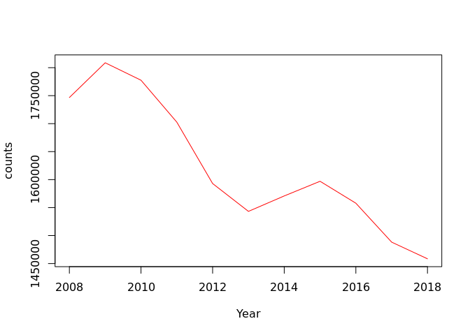

## “Real-world” example functions.

This section builds on material covered in the [Intro R
Training](https://github.com/moj-analytical-services/IntroRTraining)
course. The `dplyr` package is a commonly used R package for data
manipulation, such as creating summary tables.

First of all we need to load a few packages. `s3tools` is an MoJ package
designed to interact with Amazon s3 - we will need this to help read in
some data from an s3 bucket. `dplyr` is the package we’ll use to create
summary tables from the data. `janitor` is another useful package that
can be used to help clean data.

``` r
# Load packages
library(s3tools)
library(dplyr)
library(janitor)
```

Here we are reading in the `Prosecutions and Convictions` dataset from
s3 and storing the dataframe as a variable called `cases`.

``` r
cases <- s3tools::s3_path_to_full_df("alpha-everyone/r_functions_training/prosecutions-and-convictions-2018.csv")

# Filter for Magistrates Court to extract the prosecutions
cases <- cases %>%
  filter(`Court.Type` == "Magistrates Court")
```

Here’s a preview of the data stored in `cases`:

``` r
head(cases)
```

    ##   Year Quarter      Sex Type.of.Defendent     Age.Group Age.Range
    ## 1 2008      Q1 01: Male        01: Person 01: Juveniles 01: 10-11
    ## 2 2008      Q1 01: Male        01: Person 01: Juveniles 01: 10-11
    ## 3 2008      Q1 01: Male        01: Person 01: Juveniles 01: 10-11
    ## 4 2008      Q1 01: Male        01: Person 01: Juveniles 01: 10-11
    ## 5 2008      Q1 01: Male        01: Person 01: Juveniles 01: 10-11
    ## 6 2008      Q1 01: Male        01: Person 01: Juveniles 01: 10-11
    ##   Ethnicity        Court.Type          Offence.Type
    ## 1       N/A Magistrates Court    01 Indictable only
    ## 2       N/A Magistrates Court    01 Indictable only
    ## 3       N/A Magistrates Court    01 Indictable only
    ## 4       N/A Magistrates Court    01 Indictable only
    ## 5       N/A Magistrates Court 02 Triable either way
    ## 6       N/A Magistrates Court 02 Triable either way
    ##                    Offence.Group                          Tried
    ## 1             02 Sexual offences                   5: Not tried
    ## 2                     03 Robbery 01: Tried at magistrates court
    ## 3                     03 Robbery 01: Tried at magistrates court
    ## 4       07 Possession of weapons 01: Tried at magistrates court
    ## 5 01 Violence against the person 01: Tried at magistrates court
    ## 6 01 Violence against the person                   5: Not tried
    ##   Plea.at.the.Crown.Court Convicted..Not.convicted
    ## 1                     N/A        02: Not convicted
    ## 2                     N/A            01: Convicted
    ## 3                     N/A        02: Not convicted
    ## 4                     N/A            01: Convicted
    ## 5                     N/A            01: Convicted
    ## 6                     N/A        02: Not convicted
    ##   Sentenced...Not.sentenced                          Outcome Count
    ## 1         02: Not sentenced 01: Proceedings terminated early     1
    ## 2             01: Sentenced                 07: Found guilty     6
    ## 3         02: Not sentenced  03: Dismissed (found not guilty     1
    ## 4             01: Sentenced                 07: Found guilty     1
    ## 5             01: Sentenced                 07: Found guilty    10
    ## 6         02: Not sentenced 01: Proceedings terminated early     1

Let’s say we wanted to create a summary table showing the number of
people prosecuted in different age bands. We could do:

``` r
cases_grouped <- cases %>%
  group_by(Age.Range) %>%
  summarise(counts = sum(Count)) %>% 
  adorn_totals("row")
```

In the above code we are grouping the `cases` dataframe by the
categories in the `Age.Range` column, then summarising the number of
prosecutions in each of those categories by summing the `Count` column.
The bottom line uses a function from the `janitor` package to add a row
containing the total number of prosecutions in all categories. The
resulting dataframe is saved as a variable called `cases_grouped`.
Notice how the `dplyr` functions `group_by()` and `summarise()` require
that the column names are not enclosed in quotation marks: this
behaviour is known as non-standard evalution, and will be important
later.

``` r
cases_grouped
```

    ##                          Age.Range   counts
    ##                          01: 10-11     3324
    ##                          02: 12-14   113960
    ##                          03: 15-17   570275
    ##                          04: 18-20  1302589
    ##                          05: 21-24  2131033
    ##            06: 25+ (prior to 2017) 10209264
    ##           07: 25-29 (2017 onwards)   447108
    ##           08: 30-39 (2017 onwards)   758230
    ##           09: 40-49 (2017 onwards)   477217
    ##           10: 50-59 (2017 onwards)   261626
    ##             11: 60+ (2017 onwards)   101554
    ##           12: Not known (Juvenile)      150
    ##              13: Not known (Adult)   195459
    ##  14: Companies, public bodies etc.   114771
    ##                              Total 16686560

What if we wanted to create several different summary tables? We could
write a function to avoid writing this out each time. Following the
previous examples in this course, you might expect this function to
work:

``` r
sum_group <- function(df, group_cols, sum_col) {
  
  summary <- df %>%
    group_by(group_cols) %>%
    summarise(counts = sum(sum_col)) %>% 
    adorn_totals("row")
  
  return(summary)
  
}
```

However trying to use this function results in an error.

``` r
cases_grouped <- sum_group(df = cases, group_cols = "Age.Range", sum_col = "Count")
```

    ## Error: Column `group_cols` is unknown

This is because of the non-standard evalutation (NSE) mentioned above.
The `dplyr` functions don’t recognise `group_cols` and `sum_col` as
column names, because they can’t see that these are variables containing
the actual column names. While the NSE usually makes the `dplyr`
functions more convenient to use, it makes them slightly trickier to use
in user-defined functions.

Fortunately to get around the NSE problem, functions have been added to
the `dplyr` package that accept variables instead of straight column
names. The function below shows an example of how the functions
`group_by_at` and `summarise_at` can replace `group_by` and `summarise`.

``` r
sum_group <- function(df, group_cols, sum_col) {
  
  summary <- df %>%
    group_by_at(group_cols) %>%
    summarise_at(sum_col, sum) %>% 
    adorn_totals("row")
  
  return(summary)
  
}

cases_grouped <- sum_group(df = cases, group_cols = "Age.Range", sum_col = "Count")

cases_grouped
```

    ##                          Age.Range    Count
    ##                          01: 10-11     3324
    ##                          02: 12-14   113960
    ##                          03: 15-17   570275
    ##                          04: 18-20  1302589
    ##                          05: 21-24  2131033
    ##            06: 25+ (prior to 2017) 10209264
    ##           07: 25-29 (2017 onwards)   447108
    ##           08: 30-39 (2017 onwards)   758230
    ##           09: 40-49 (2017 onwards)   477217
    ##           10: 50-59 (2017 onwards)   261626
    ##             11: 60+ (2017 onwards)   101554
    ##           12: Not known (Juvenile)      150
    ##              13: Not known (Adult)   195459
    ##  14: Companies, public bodies etc.   114771
    ##                              Total 16686560

If you still wanted to use the `group_by` and `summarise` functions in a
user-defined function, then variables containing the column names can be
enclosed by `!!as.name()` to convert them into straight column names,
like so:

``` r
sum_group <- function(df, group_cols, sum_col) {
  
  summary <- df %>%
    group_by(!!as.name(group_cols)) %>%
    summarise(counts = sum(!!as.name(sum_col))) %>% 
    adorn_totals("row")
  
  return(summary)
  
}

cases_grouped <- sum_group(df = cases, group_cols = "Age.Range", sum_col = "Count")

cases_grouped
```

    ##                          Age.Range   counts
    ##                          01: 10-11     3324
    ##                          02: 12-14   113960
    ##                          03: 15-17   570275
    ##                          04: 18-20  1302589
    ##                          05: 21-24  2131033
    ##            06: 25+ (prior to 2017) 10209264
    ##           07: 25-29 (2017 onwards)   447108
    ##           08: 30-39 (2017 onwards)   758230
    ##           09: 40-49 (2017 onwards)   477217
    ##           10: 50-59 (2017 onwards)   261626
    ##             11: 60+ (2017 onwards)   101554
    ##           12: Not known (Juvenile)      150
    ##              13: Not known (Adult)   195459
    ##  14: Companies, public bodies etc.   114771
    ##                              Total 16686560

We can make this function more general by making the total row optional:

``` r
sum_group <- function(df, group_cols, sum_col, add_total=F) {
  
  summary <- df %>%
    group_by_at(group_cols) %>%
    summarise(counts = sum(!!as.name(sum_col)))
  
  if (add_total == T) {
    summary <- summary %>% adorn_totals("row")
  }
  
  return(summary)
  
}

cases_grouped <- sum_group(df = cases, group_cols = "Age.Range", sum_col = "Count", add_total=F)

cases_grouped
```

    ## # A tibble: 14 x 2
    ##    Age.Range                           counts
    ##    <chr>                                <int>
    ##  1 01: 10-11                             3324
    ##  2 02: 12-14                           113960
    ##  3 03: 15-17                           570275
    ##  4 04: 18-20                          1302589
    ##  5 05: 21-24                          2131033
    ##  6 06: 25+ (prior to 2017)           10209264
    ##  7 07: 25-29 (2017 onwards)            447108
    ##  8 08: 30-39 (2017 onwards)            758230
    ##  9 09: 40-49 (2017 onwards)            477217
    ## 10 10: 50-59 (2017 onwards)            261626
    ## 11 11: 60+ (2017 onwards)              101554
    ## 12 12: Not known (Juvenile)               150
    ## 13 13: Not known (Adult)               195459
    ## 14 14: Companies, public bodies etc.   114771

The `sum_group()` function also allows us to add any number of grouping
columns:

``` r
cases_grouped <- sum_group(df = cases, 
                           group_cols = c("Age.Range", "Offence.Group"), 
                           sum_col = "Count",
                           add_total=T)

head(cases_grouped)
```

    ##  Age.Range                  Offence.Group counts
    ##  01: 10-11 01 Violence against the person    164
    ##  01: 10-11             02 Sexual offences     65
    ##  01: 10-11                     03 Robbery    198
    ##  01: 10-11              04 Theft Offences    782
    ##  01: 10-11   05 Criminal damage and arson    225
    ##  01: 10-11               06 Drug offences      8

Here’s another example: say we want to produce some plots, and want them
all to have the same style. We can define the style of the plot in a
function, then we only have to change the styling in one place if it
needs changing. Here we’ve gone for a line chart with a red line.

``` r
make_line_chart <- function(df, x_col, y_col){
  
  x <- df %>% pull(x_col)
  y <- df %>% pull(y_col)
  
  plot(x, y, col='red', type='l', xlab=x_col, ylab=y_col)
  
}
```

Let’s use the `sum_group()` and `make_line_chart()` functions to produce
a plot of the number of prosecutions in each year.

``` r
time_series <- sum_group(df = cases, 
                         group_cols = c("Year"), 
                         sum_col = "Count")

make_line_chart(time_series, x="Year", y="counts")
```

<!-- -->
