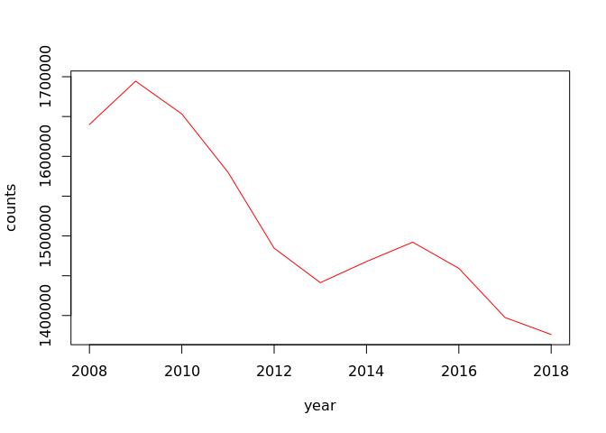

## “Real-world” example functions.

This section builds on material covered in the [Intro R
Training](https://github.com/moj-analytical-services/IntroRTraining)
course. The `dplyr` package is a commonly used R package for data
manipulation, such as creating summary tables.

First of all we need to load a few packages. `s3tools` is an MoJ package
designed to interact with Amazon s3 - we will need this to help read in
some data from an s3 bucket. `dplyr` is the package we’ll use to create
summary tables from the data. `janitor` is another useful package that
can be used to help clean data.

``` r
# Load packages
library(s3tools)
library(dplyr)
library(janitor)
library(stringr)
```

Here we are reading in the `Prosecutions and Convictions` dataset from
s3 and storing the dataframe as a variable called `cases`.

``` r
cases <- s3tools::s3_path_to_full_df("alpha-everyone/r_functions_training/prosecutions-and-convictions-2018.csv")

# Filter for Magistrates Court to extract the prosecutions
cases <- cases %>%
  filter(`Court.Type` == "Magistrates Court")
```

Here’s a preview of the data stored in `cases`:

``` r
head(cases)
```

    ##   Year Quarter      Sex Type.of.Defendent     Age.Group Age.Range
    ## 1 2008      Q1 01: Male        01: Person 01: Juveniles 01: 10-11
    ## 2 2008      Q1 01: Male        01: Person 01: Juveniles 01: 10-11
    ## 3 2008      Q1 01: Male        01: Person 01: Juveniles 01: 10-11
    ## 4 2008      Q1 01: Male        01: Person 01: Juveniles 01: 10-11
    ## 5 2008      Q1 01: Male        01: Person 01: Juveniles 01: 10-11
    ## 6 2008      Q1 01: Male        01: Person 01: Juveniles 01: 10-11
    ##   Ethnicity        Court.Type          Offence.Type
    ## 1       N/A Magistrates Court    01 Indictable only
    ## 2       N/A Magistrates Court    01 Indictable only
    ## 3       N/A Magistrates Court    01 Indictable only
    ## 4       N/A Magistrates Court    01 Indictable only
    ## 5       N/A Magistrates Court 02 Triable either way
    ## 6       N/A Magistrates Court 02 Triable either way
    ##                    Offence.Group                          Tried
    ## 1             02 Sexual offences                   5: Not tried
    ## 2                     03 Robbery 01: Tried at magistrates court
    ## 3                     03 Robbery 01: Tried at magistrates court
    ## 4       07 Possession of weapons 01: Tried at magistrates court
    ## 5 01 Violence against the person 01: Tried at magistrates court
    ## 6 01 Violence against the person                   5: Not tried
    ##   Plea.at.the.Crown.Court Convicted..Not.convicted
    ## 1                     N/A        02: Not convicted
    ## 2                     N/A            01: Convicted
    ## 3                     N/A        02: Not convicted
    ## 4                     N/A            01: Convicted
    ## 5                     N/A            01: Convicted
    ## 6                     N/A        02: Not convicted
    ##   Sentenced...Not.sentenced                          Outcome Count
    ## 1         02: Not sentenced 01: Proceedings terminated early     1
    ## 2             01: Sentenced                 07: Found guilty     6
    ## 3         02: Not sentenced  03: Dismissed (found not guilty     1
    ## 4             01: Sentenced                 07: Found guilty     1
    ## 5             01: Sentenced                 07: Found guilty    10
    ## 6         02: Not sentenced 01: Proceedings terminated early     1

### Exercise 1

Use the `generalise_names()` functions defined above to clean the column
headings of this dataset (Hint: use the function `colnames()` to
retrieve the column headings of the dataset as a vector).

Solution:

``` r
generalise_names <- function(names){
  names <- tolower(names)
  names <- stringr::str_trim(names)
  names <- stringr::str_replace_all(names, " ", "_")
  names <- stringr::str_replace_all(names, "[^A-Za-z0-9]", "_")
  names <- stringr::str_replace_all(names, "([_])\\1+", "\\1")
  names <- stringr::str_replace_all(names, "^\\_+|\\_+$", "")
  return(names)
}

colnames(cases) <- generalise_names(colnames(cases))

head(cases)
```

    ##   year quarter      sex type_of_defendent     age_group age_range
    ## 1 2008      Q1 01: Male        01: Person 01: Juveniles 01: 10-11
    ## 2 2008      Q1 01: Male        01: Person 01: Juveniles 01: 10-11
    ## 3 2008      Q1 01: Male        01: Person 01: Juveniles 01: 10-11
    ## 4 2008      Q1 01: Male        01: Person 01: Juveniles 01: 10-11
    ## 5 2008      Q1 01: Male        01: Person 01: Juveniles 01: 10-11
    ## 6 2008      Q1 01: Male        01: Person 01: Juveniles 01: 10-11
    ##   ethnicity        court_type          offence_type
    ## 1       N/A Magistrates Court    01 Indictable only
    ## 2       N/A Magistrates Court    01 Indictable only
    ## 3       N/A Magistrates Court    01 Indictable only
    ## 4       N/A Magistrates Court    01 Indictable only
    ## 5       N/A Magistrates Court 02 Triable either way
    ## 6       N/A Magistrates Court 02 Triable either way
    ##                    offence_group                          tried
    ## 1             02 Sexual offences                   5: Not tried
    ## 2                     03 Robbery 01: Tried at magistrates court
    ## 3                     03 Robbery 01: Tried at magistrates court
    ## 4       07 Possession of weapons 01: Tried at magistrates court
    ## 5 01 Violence against the person 01: Tried at magistrates court
    ## 6 01 Violence against the person                   5: Not tried
    ##   plea_at_the_crown_court convicted_not_convicted sentenced_not_sentenced
    ## 1                     N/A       02: Not convicted       02: Not sentenced
    ## 2                     N/A           01: Convicted           01: Sentenced
    ## 3                     N/A       02: Not convicted       02: Not sentenced
    ## 4                     N/A           01: Convicted           01: Sentenced
    ## 5                     N/A           01: Convicted           01: Sentenced
    ## 6                     N/A       02: Not convicted       02: Not sentenced
    ##                            outcome count
    ## 1 01: Proceedings terminated early     1
    ## 2                 07: Found guilty     6
    ## 3  03: Dismissed (found not guilty     1
    ## 4                 07: Found guilty     1
    ## 5                 07: Found guilty    10
    ## 6 01: Proceedings terminated early     1

There are some numeric indices in the columns that may be undesirable.
We can write a function to remove these

``` r
remove_indices_from_columns <- function(data){

  # Remove 1 or 2 digits followed by a semicolon for columns that contain strings
  data <- lapply(data, function(x) { if (is.character(x)) gsub("^\\d{1,2}:", "", x) else x })
  # Remove 1 or 2 digits followed by a space
  data <- lapply(data, function(x) { if (is.character(x)) gsub("^\\d{1,2}\\s", "", x) else x })  

  return(data)
  
}

cases[] <- remove_indices_from_columns(cases)

head(cases)
```

    ##   year quarter   sex type_of_defendent  age_group age_range ethnicity
    ## 1 2008      Q1  Male            Person  Juveniles     10-11       N/A
    ## 2 2008      Q1  Male            Person  Juveniles     10-11       N/A
    ## 3 2008      Q1  Male            Person  Juveniles     10-11       N/A
    ## 4 2008      Q1  Male            Person  Juveniles     10-11       N/A
    ## 5 2008      Q1  Male            Person  Juveniles     10-11       N/A
    ## 6 2008      Q1  Male            Person  Juveniles     10-11       N/A
    ##          court_type       offence_type               offence_group
    ## 1 Magistrates Court    Indictable only             Sexual offences
    ## 2 Magistrates Court    Indictable only                     Robbery
    ## 3 Magistrates Court    Indictable only                     Robbery
    ## 4 Magistrates Court    Indictable only       Possession of weapons
    ## 5 Magistrates Court Triable either way Violence against the person
    ## 6 Magistrates Court Triable either way Violence against the person
    ##                         tried plea_at_the_crown_court
    ## 1                   Not tried                     N/A
    ## 2  Tried at magistrates court                     N/A
    ## 3  Tried at magistrates court                     N/A
    ## 4  Tried at magistrates court                     N/A
    ## 5  Tried at magistrates court                     N/A
    ## 6                   Not tried                     N/A
    ##   convicted_not_convicted sentenced_not_sentenced
    ## 1           Not convicted           Not sentenced
    ## 2               Convicted               Sentenced
    ## 3           Not convicted           Not sentenced
    ## 4               Convicted               Sentenced
    ## 5               Convicted               Sentenced
    ## 6           Not convicted           Not sentenced
    ##                         outcome count
    ## 1  Proceedings terminated early     1
    ## 2                  Found guilty     6
    ## 3   Dismissed (found not guilty     1
    ## 4                  Found guilty     1
    ## 5                  Found guilty    10
    ## 6  Proceedings terminated early     1

For the final cleaning stage, we can make missing and unknown values
more consistent using the following function:

``` r
clean_not_known <- function(data, not_known_phrase) {
  
  # Replace any missing (NA) values
  data <- data %>% replace(., is.na(.), not_known_phrase)
  
  # Create a version of the dataframe with all strings converted to lower
  # case and any white space at the start or end trimmed. This will make
  # the following stage easier.
  data_lowercase <- data
  data_lowercase[] <- lapply(data_lowercase, tolower)
  data_lowercase[] <- lapply(data_lowercase, stringr::str_trim)
  
  # Replace strings in the data that refer to a missing or unknown values
  data[data_lowercase == "n/a"] <- not_known_phrase
  data[data_lowercase == "not known"] <- not_known_phrase
  data[data_lowercase == "unknown"] <- not_known_phrase
  data[data_lowercase == "not stated"] <- not_known_phrase
  
  return(data)
  
}

cases <- clean_not_known(cases, "Not known")

head(cases)
```

    ##   year quarter   sex type_of_defendent  age_group age_range ethnicity
    ## 1 2008      Q1  Male            Person  Juveniles     10-11 Not known
    ## 2 2008      Q1  Male            Person  Juveniles     10-11 Not known
    ## 3 2008      Q1  Male            Person  Juveniles     10-11 Not known
    ## 4 2008      Q1  Male            Person  Juveniles     10-11 Not known
    ## 5 2008      Q1  Male            Person  Juveniles     10-11 Not known
    ## 6 2008      Q1  Male            Person  Juveniles     10-11 Not known
    ##          court_type       offence_type               offence_group
    ## 1 Magistrates Court    Indictable only             Sexual offences
    ## 2 Magistrates Court    Indictable only                     Robbery
    ## 3 Magistrates Court    Indictable only                     Robbery
    ## 4 Magistrates Court    Indictable only       Possession of weapons
    ## 5 Magistrates Court Triable either way Violence against the person
    ## 6 Magistrates Court Triable either way Violence against the person
    ##                         tried plea_at_the_crown_court
    ## 1                   Not tried               Not known
    ## 2  Tried at magistrates court               Not known
    ## 3  Tried at magistrates court               Not known
    ## 4  Tried at magistrates court               Not known
    ## 5  Tried at magistrates court               Not known
    ## 6                   Not tried               Not known
    ##   convicted_not_convicted sentenced_not_sentenced
    ## 1           Not convicted           Not sentenced
    ## 2               Convicted               Sentenced
    ## 3           Not convicted           Not sentenced
    ## 4               Convicted               Sentenced
    ## 5               Convicted               Sentenced
    ## 6           Not convicted           Not sentenced
    ##                         outcome count
    ## 1  Proceedings terminated early     1
    ## 2                  Found guilty     6
    ## 3   Dismissed (found not guilty     1
    ## 4                  Found guilty     1
    ## 5                  Found guilty    10
    ## 6  Proceedings terminated early     1

### Exercise 2

Write a wrapper function to apply `generalise_names()`,
`remove_indices_from_columns()`, and `clean_not_known()` to the dataset.

Solution:

``` r
clean_prosec_and_convic <- function(data) {
  
  # Clean the column headings
  colnames(cases) <- generalise_names(colnames(cases))
  # Remove numeric indices from columns
  cases[] <- remove_indices_from_columns(cases)
  # Make missing/unknown value entries more consistent
  cases <- clean_not_known(cases, "Not known")
  
  return(cases)
  
}
```

Let’s say we wanted to create a summary table showing the number of
people prosecuted in different age bands. We could do:

``` r
cases_grouped <- cases %>%
  group_by(age_range) %>%
  summarise(counts = sum(count)) %>% 
  adorn_totals("row")
```

In the above code we are grouping the `cases` dataframe by the
categories in the `Age.Range` column, then summarising the number of
prosecutions in each of those categories by summing the `Count` column.
The bottom line uses a function from the `janitor` package to add a row
containing the total number of prosecutions in all categories. The
resulting dataframe is saved as a variable called `cases_grouped`.
Notice how the `dplyr` functions `group_by()` and `summarise()` require
that the column names are not enclosed in quotation marks: this
behaviour is known as non-standard evalution, and will be important
later.

``` r
cases_grouped
```

    ##                       age_range   counts
    ##                           10-11     3324
    ##                           12-14   113960
    ##                           15-17   570275
    ##                           18-20  1302589
    ##                           21-24  2131033
    ##            25-29 (2017 onwards)   447108
    ##             25+ (prior to 2017) 10209264
    ##            30-39 (2017 onwards)   758230
    ##            40-49 (2017 onwards)   477217
    ##            50-59 (2017 onwards)   261626
    ##              60+ (2017 onwards)   101554
    ##   Companies, public bodies etc.   114771
    ##               Not known (Adult)   195459
    ##            Not known (Juvenile)      150
    ##                           Total 16686560

What if we wanted to create several different summary tables? We could
write a function to avoid writing this out each time. Following the
previous examples in this course, you might expect this function to
work:

``` r
sum_group <- function(df, group_cols, sum_col) {
  
  summary <- df %>%
    group_by(group_cols) %>%
    summarise(counts = sum(sum_col)) %>% 
    adorn_totals("row")
  
  return(summary)
  
}
```

However trying to use this function results in an error.

``` r
cases_grouped <- sum_group(df = cases, group_cols = "age_range", sum_col = "count")
```

    ## Error: Column `group_cols` is unknown

This is because of the non-standard evalutation (NSE) mentioned above.
The `dplyr` functions don’t recognise `group_cols` and `sum_col` as
column names, because they can’t see that these are variables containing
the actual column names. While the NSE usually makes the `dplyr`
functions more convenient to use, it makes them slightly trickier to use
in user-defined functions.

Fortunately to get around the NSE problem, functions have been added to
the `dplyr` package that accept variables instead of straight column
names. The function below shows an example of how the functions
`group_by_at` and `summarise_at` can replace `group_by` and `summarise`.

``` r
sum_group <- function(df, group_cols, sum_col) {
  
  summary <- df %>%
    group_by_at(group_cols) %>%
    summarise_at(sum_col, sum) %>% 
    adorn_totals("row")
  
  return(summary)
  
}

cases_grouped <- sum_group(df = cases, group_cols = "age_range", sum_col = "count")

cases_grouped
```

    ##                       age_range    count
    ##                           10-11     3324
    ##                           12-14   113960
    ##                           15-17   570275
    ##                           18-20  1302589
    ##                           21-24  2131033
    ##            25-29 (2017 onwards)   447108
    ##             25+ (prior to 2017) 10209264
    ##            30-39 (2017 onwards)   758230
    ##            40-49 (2017 onwards)   477217
    ##            50-59 (2017 onwards)   261626
    ##              60+ (2017 onwards)   101554
    ##   Companies, public bodies etc.   114771
    ##               Not known (Adult)   195459
    ##            Not known (Juvenile)      150
    ##                           Total 16686560

If you still wanted to use the `group_by` and `summarise` functions in a
user-defined function, then variables containing the column names can be
enclosed by `!!as.name()` to convert them into straight column names,
like so:

``` r
sum_group <- function(df, group_cols, sum_col) {
  
  summary <- df %>%
    group_by(!!as.name(group_cols)) %>%
    summarise(counts = sum(!!as.name(sum_col))) %>% 
    adorn_totals("row")
  
  return(summary)
  
}

cases_grouped <- sum_group(df = cases, group_cols = "age_range", sum_col = "count")

cases_grouped
```

    ##                       age_range   counts
    ##                           10-11     3324
    ##                           12-14   113960
    ##                           15-17   570275
    ##                           18-20  1302589
    ##                           21-24  2131033
    ##            25-29 (2017 onwards)   447108
    ##             25+ (prior to 2017) 10209264
    ##            30-39 (2017 onwards)   758230
    ##            40-49 (2017 onwards)   477217
    ##            50-59 (2017 onwards)   261626
    ##              60+ (2017 onwards)   101554
    ##   Companies, public bodies etc.   114771
    ##               Not known (Adult)   195459
    ##            Not known (Juvenile)      150
    ##                           Total 16686560

We can make this function more general by making the total row optional:

``` r
sum_group <- function(df, group_cols, sum_col, add_total=F) {
  
  summary <- df %>%
    group_by_at(group_cols) %>%
    summarise(counts = sum(!!as.name(sum_col)))
  
  if (add_total == T) {
    summary <- summary %>% adorn_totals("row")
  }
  
  return(summary)
  
}

cases_grouped <- sum_group(df = cases, group_cols = "age_range", sum_col = "count", add_total=F)

cases_grouped
```

    ## # A tibble: 14 x 2
    ##    age_range                          counts
    ##    <chr>                               <int>
    ##  1 " 10-11"                             3324
    ##  2 " 12-14"                           113960
    ##  3 " 15-17"                           570275
    ##  4 " 18-20"                          1302589
    ##  5 " 21-24"                          2131033
    ##  6 " 25-29 (2017 onwards)"            447108
    ##  7 " 25+ (prior to 2017)"           10209264
    ##  8 " 30-39 (2017 onwards)"            758230
    ##  9 " 40-49 (2017 onwards)"            477217
    ## 10 " 50-59 (2017 onwards)"            261626
    ## 11 " 60+ (2017 onwards)"              101554
    ## 12 " Companies, public bodies etc."   114771
    ## 13 " Not known (Adult)"               195459
    ## 14 " Not known (Juvenile)"               150

The `sum_group()` function also allows us to add any number of grouping
columns:

``` r
cases_grouped <- sum_group(df = cases, 
                           group_cols = c("year", "offence_group"), 
                           sum_col = "count",
                           add_total=T)

head(cases_grouped)
```

    ##  year                        offence_group counts
    ##  2008            Criminal damage and arson  11278
    ##  2008                        Drug offences  56953
    ##  2008                       Fraud Offences  16262
    ##  2008 Miscellaneous crimes against society  71652
    ##  2008                Possession of weapons  17968
    ##  2008                Public order offences  10465

Here’s another example: say we want to produce some plots, and want them
all to have the same style. We can define the style of the plot in a
function, then we only have to change the styling in one place if it
needs changing. Here we’ve gone for a line chart with a red line.

``` r
make_line_chart <- function(df, x_col, y_col){
  
  x <- df %>% pull(x_col)
  y <- df %>% pull(y_col)
  
  plot(x, y, col='red', type='l', xlab=x_col, ylab=y_col)
  
}
```

Let’s use the `sum_group()` and `make_line_chart()` functions to produce
a plot of the number of prosecutions in each year.

``` r
time_series <- sum_group(df = cases, 
                         group_cols = c("year"), 
                         sum_col = "count")

make_line_chart(time_series, x="year", y="counts")
```

<!-- -->

More ideas -

  - A graph where you can vary which offence is plotted and/or whether
    it plots “Offence Type” or “Offence Group” (though this probably
    would have to use NSE)
  - Function which pulls out the most recent year and quarter in the
    data?
